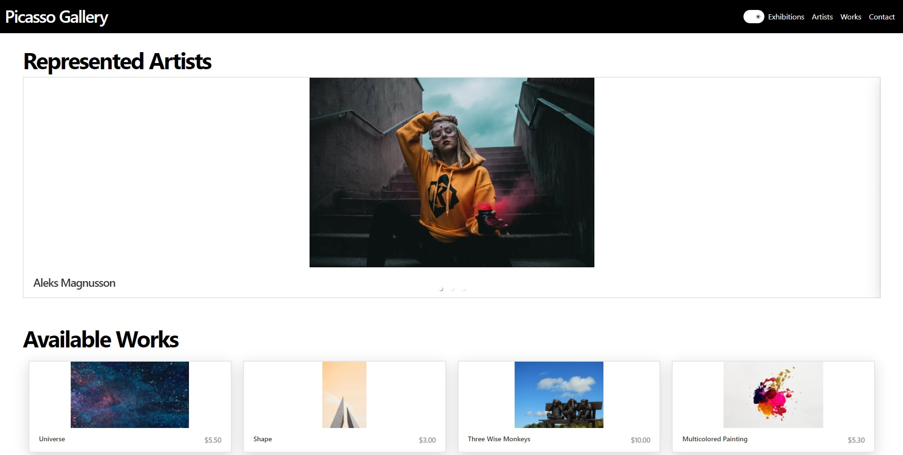

# Picasso Gallery App
A student application that demenstrates the use of [NextUI](https://nextui.org/) in a React application created using the Creat-React-App toolchain.
<p align="center">
  
</p>

> **Disclaimer**
>
>This is a student project. All the images used in the application are sourced from Pexel and are under a free to use license. 


## Installation

You'll need Git, Node.js and NPM installed on your computer. From your command line:

```bash
# Clone this repository
$ git clone https://github.com/kelvinshen00/Picasso.git

# Install dependencies
$ npm install
```

## Run the app
From your command lines:
```bash
$ npm run start
```
Open [http://localhost:3000](http://localhost:3000) to view it in your browser.

